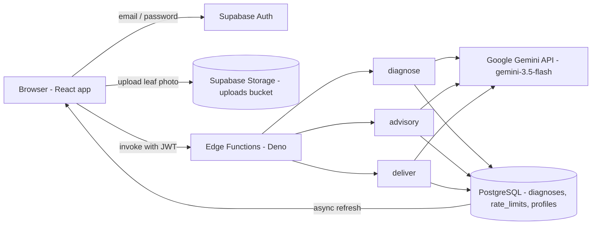

# AgriN — Architecture Guide

This guide explains how AgriN is built and how a single scan moves through the system. It describes what the code actually does today.

## At a glance

## 1. Product architecture

AgriN is a single-page React app backed by Supabase. The frontend is intentionally thin: it handles authentication, the scan form, image upload, and rendering results. All AI work happens server-side in Edge Functions so the Google Gemini key never reaches the browser.

A scan follows the **Scan → Understand → Act → Monitor** loop:

1. **Scan** — the user picks a crop and uploads a leaf photo.
2. **Understand** — Gemini analyzes the photo and returns a structured diagnosis.
3. **Act** — the user receives actionable advisory steps, optionally in Kannada (text + audio).
4. **Monitor** — every scan is saved to PostgreSQL and shown on the Crop Health screen.

## 2. Frontend architecture

- **Stack:** React 19 + TypeScript + Vite 8 + Tailwind CSS 4.
- **Routing:** `react-router-dom` — `/signin`, `/signup`, `/forgot` render standalone auth screens; `/`, `/scan`, `/health`, `/settings` render inside the `AppLayout` (desktop side rail / mobile top header + bottom nav).
- **Auth state:** `AuthProvider` (`src/hooks/useAuth.tsx`) owns session state. First-time visitors are auto-provisioned a local account so the scan experience is instant; signing out explicitly reveals the sign-in/sign-up gate (`SignedOutGate`, enforced by `RequireSignedIn`).
- **Scan flow** (`src/pages/ScanPage.tsx`): phases `form → analyzing → result`, with four truthful progress stages (Preparing your scan → Examining the crop → Preparing your guidance → Finalizing your guidance) and an honest retry path when the AI service is busy.
- **Language:** `src/lib/languages.ts` defines nine languages; English and Kannada are available, the other seven are marked "Coming soon" (never faked). The chosen language persists in `localStorage` (`agrin_language`) and drives the result's guidance-language toggle.

## 3. Authentication

- Supabase Auth with email/password (`enable_confirmations = false` locally, so sign-up returns a session immediately).
- Sign-in, sign-up, forgot-password (password-reset email with redirect back to the app), and sign-out are all implemented; Supabase errors are humanized for the user (e.g. invalid credentials, duplicate account, rate-limit, network failure).
- Auto-provisioning: a brand-new visitor without a session gets an anonymous-style account sign-in attempt, with a local email/password fallback (`agrin_*@agrin.local`), so a "no sign-up" demo still works. Explicit sign-out sets a sessionStorage marker that disables auto-provisioning until the next sign-in.
- Every Edge Function call requires a valid JWT (`verify_jwt = true`).

## 4. Image upload and storage

- Images are uploaded to the private `uploads` bucket under `{user.id}/{uuid}.{ext}`.
- Bucket policy: users can only insert/read objects inside their own folder; only image content types and files under 5 MB are accepted.
- The frontend validates type and size before upload; the Edge Function re-validates magic bytes after download (defense in depth).

## 5. Diagnosis pipeline (`diagnose` Edge Function)

1. Verifies the JWT and that `imageUrl`/`imagePath` belongs to the caller (`{uid}/…`).
2. Sanitizes crop and location input.
3. Applies the function rate limit (5/hour/user).
4. Downloads and verifies the image (≤ 5 MB, real image magic bytes).
5. Calls Gemini Vision (`gemini-3.5-flash`) with the image and an instruction to return strict JSON: `{ disease, symptoms, advisory, confidence }`.
6. Parses and validates the JSON (confidence only `High | Medium | Low`).
7. Persists the result to the `diagnoses` table with status `success` (or `failed` on error).

## 6. Advisory pipeline (`advisory` Edge Function)

- Takes the `diagnosisId`, verifies ownership (IDOR-safe query), and requests a plain-language follow-up advisory from Gemini.
- Stores it as `advisory_text`. Weather context is intentionally `null` — the app does not claim weather-based recommendations.

## 7. Language / TTS pipeline (`deliver` Edge Function + browser)

- `deliver` requests a fluent Kannada translation of the advisory from Gemini and stores it as `translated_advisory`. It also records an honest `sms_status` (`simulated`, `sent: false`) — SMS is not actually sent.
- Reading = client-side: the result page's "Language guidance" card lets the user switch English ↔ Kannada; audio uses the browser's Web Speech API with the closest available `kn` voice (or a transparent "fallback voice" note).

## 8. Database and history

- **Tables:** `profiles` (per-user phone), `diagnoses` (crop, image_path, status, disease, symptoms, confidence, advisory_text, weather_context, translated_advisory, sms_status), `rate_limits` (rolling rate-limit hits per endpoint).
- Migrations live in `supabase/migrations/`.
- The Crop Health screen (`/health`) reads the authenticated user's recent diagnoses: current status card, per-crop grouping, thumbnails (via short-lived signed URLs), and confidence badges. Charts/trends are not fabricated — only real stored rows are shown.

## 9. Security and row-level security

- **No frontend secrets:** the Gemini key exists only server-side (`supabase/functions/.env`, gitignored).
- **RLS** on every table: users can only read/write their own rows.
- **Private storage bucket** (own-folder-only insert/select) with size + content-type validation on both ends.
- **Input validation:** crop/location sanitized; ownership checked before any action.
- **Rate limiting** per user per function (diagnose 5, advisory 10, deliver 10 per hour) via a PostgreSQL helper.
- **Honest errors:** failures surface as user-facing friendly states; nothing is faked.

## 10. AI integration (Google Gemini API)

- Google technology used: **Google Gemini API only** — specifically the `gemini-3.5-flash` model, called from the `diagnose`, `advisory`, and `deliver` Edge Functions using the official `@google/generative-ai` SDK (Deno).
- The Gemini key is injected through the Edge Function environment; the model is contacted server-side. No Firebase, Vertex AI, Google Cloud, or Google Maps.
- Retries with backoff are applied for transient failures; the 45 s per-attempt timeout turns a genuinely hung call into an honest "service unavailable" response rather than a silent load forever.

## 11. Failure and recovery

| Failure | Behaviour |
|---|---|
| Gemini is busy / quota exceeded | Edge Function returns `503`/`429`; the app shows "AgriN could not complete the analysis right now" with a retry path. |
| AI call times out (45 s) | Treated as an honest unavailable error; the scan is marked `failed`. |
| Upload rejected (type/size) | Frontend validation stops before upload with a clear message. |
| Edge Function unreachable | "Could not reach the AgriN service. Check your connection and try again." |
| Auth unavailable | A dedicated "Couldn't reach AgriN" screen with a Try again action. |
| Missing/empty scan history | Crop Health shows a friendly empty state, never a fake chart. |