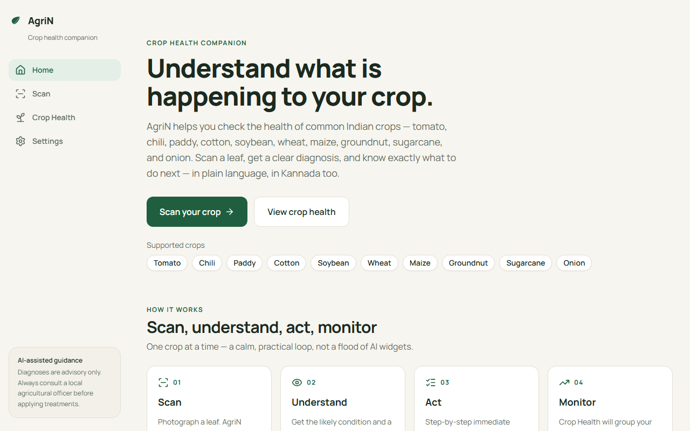
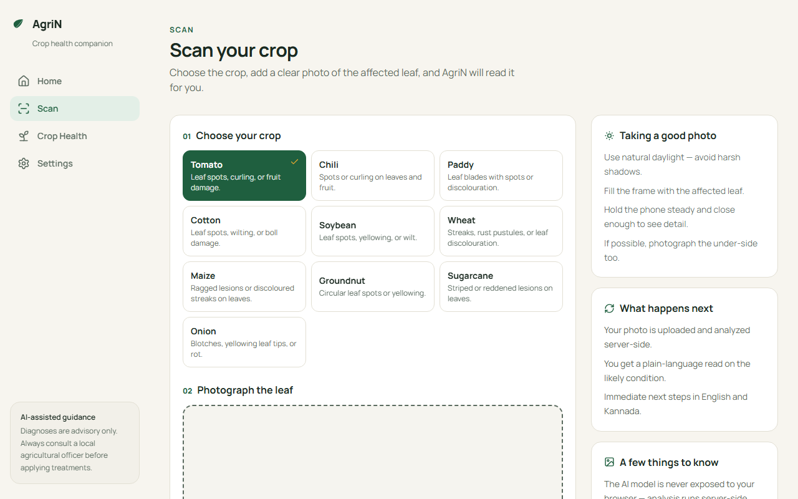
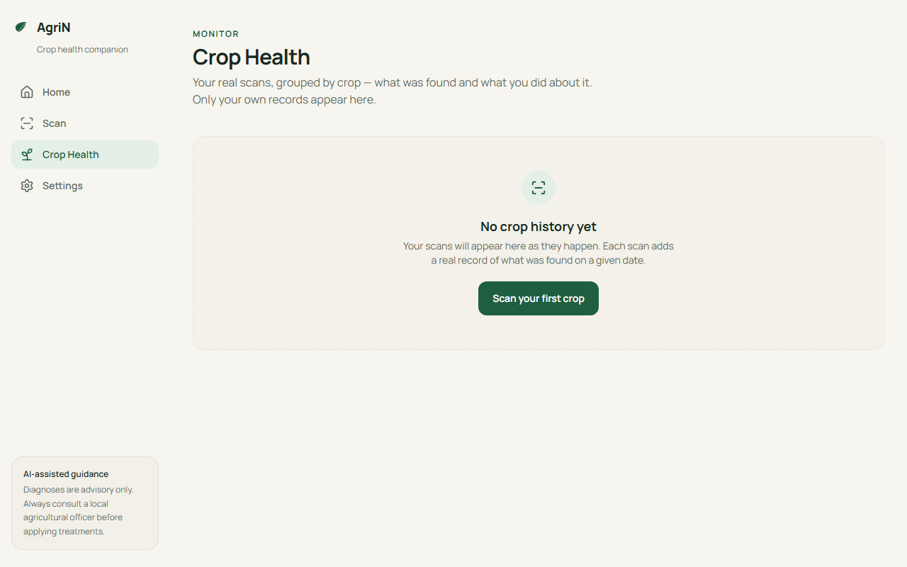
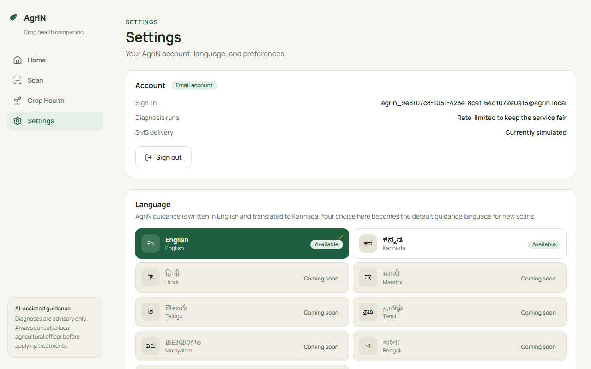
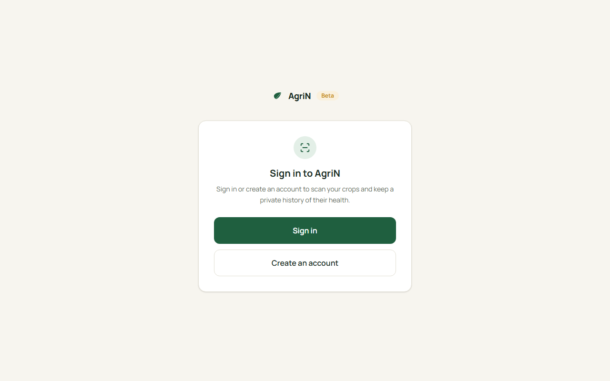

# AgriN — A crop health companion

Take a photo of an affected leaf. AgriN reads it, explains what it likely is, and tells you what to do next — in plain language, in Kannada too.

One calm loop:

**Scan → Understand → Act → Monitor**

- **Scan** — choose a crop and photograph an affected leaf.
- **Understand** — get a plain-language read on the likely condition, with a confidence level when the AI model provides one.
- **Act** — receive step-by-step, action-oriented advisory you can act on with local resources.
- **Monitor** — every scan is saved to your Crop Health history, grouped by crop, so you can track how each crop is going over time.

> **AI output is advisory only — it is not a professional agricultural diagnosis.** Always confirm treatments with a local agricultural extension officer.

---

## Overview

Crop diseases cost time and yield, and help is not always close by. AgriN puts a practical, private crop-health assistant in your pocket. You photograph an affected leaf, and AgriN runs a **scan → understand → act → monitor** loop entirely over the web — no app install, no specialist knowledge required, and guidance delivered in a language the farmer actually reads.

## What problem it solves

Small-scale farmers often face a slow, uncertain path when a crop starts failing: guessing from memory, waiting for an expert, or treating blindly. AgriN shortens the "what is wrong with my crop?" step — turning a photo of a leaf into an honest, actionable read with clear next steps, saved over time so patterns become visible.

## How it works — the AgriN loop

1. **Choose a crop** — from 10 supported Indian crops.
2. **Upload a leaf photo** — validated, previewed, and stored in a private bucket.
3. **AI analyzes it** — the image goes server-side to Google Gemini, which reads the crop context + photo together.
4. **Get a diagnosis** — the likely condition, what the photo shows, and a confidence level when the model provides one.
5. **Get an advisory** — step-by-step, action-oriented guidance you can act on with local resources.
6. **Choose your guidance language** — English or Kannada, with device text-to-speech where supported.
7. **Monitor** — every scan is saved to Crop Health and grouped by crop for tracking over time.

## Demo

- **Demo video:** *[Add final YouTube link before submission]*
- **Live application:** *[Add deployed URL if available]*

The recorded demo follows the **verified Tomato golden path**: sign in → select Tomato → upload a real leaf photo → AI processing → real diagnosis → advisory → Kannada guidance + audio → saved scan in Crop Health.

## Screenshots

> Screenshots below are real captures from the running app. *(Some captures are added during final repo prep — if any is missing here, it will be filled from the demo recording session.)*







## Key features

- **Supabase Auth** — sign in / sign up with email, session persistence, sign out, and password reset. A legitimate JWT session is required before any scan.
- **Crop selection** — keyboard- and screen-reader-accessible picker across 10 crops.
- **Leaf photo upload** — image validation (type + size ≤ 5 MB) in the browser *and* again server-side, with a live preview.
- **AI diagnosis** — the leaf photo is analyzed server-side by Google Gemini; confidence comes only from the model, never synthesized.
- **AI advisory** — practical, action-oriented guidance in plain language.
- **Kannada guidance** — the advisory is translated to ಕನ್ನಡ (Kannada) and playable with device text-to-speech.
- **Crop Health history** — scans are saved to a private per-user history, grouped by crop.
- **Private by design** — Row-Level Security, private storage, and owner-scoped file paths.
- **Honest error handling** — friendly, truthful errors for every failure path (slow AI, busy model, upload problems, quota limits); SMS is clearly labeled simulated rather than faked.
- **Responsive & accessible** — layouts from small phones to desktop, keyboard navigation, visible focus, and reduced-motion support.

## Supported crops

Currently supports crop selection for **Tomato, Chili, Paddy, Cotton, Soybean, Wheat, Maize, Groundnut, Sugarcane, and Onion**. The AI always diagnoses from the uploaded photo — listing a crop here means it is *selectable*, not a claim that every possible disease of that crop is covered.

## Languages

| Language | Status |
|---|---|
| English | Available (app UI + guidance) |
| ಕನ್ನಡ (Kannada) | Available (guidance translation + text-to-speech) |
| हिन्दी, मराठी, తెలుగు, தமிழ், മലയാളം, বাংলা, ગુજરાતી | Coming soon (selector present, honestly disabled) |

AgriN does **not** claim full multilingual AI translation. English and Kannada guidance are real today; the remaining languages are marked "coming soon" rather than faked.

## Google technologies

**Google Gemini API** (`gemini-3.5-flash`) powers the AI heart of AgriN:

- The `diagnose` Edge Function sends the user's crop context plus the uploaded leaf photo to Gemini, which returns a structured, plain-language diagnosis (condition, symptoms, advisory, and a confidence level).
- The `advisory` Edge Function asks Gemini for a focused, actionable treatment plan.
- The `deliver` Edge Function asks Gemini to translate the advisory into fluent Kannada.

Every Gemini call happens **server-side** — the API key never reaches the browser, and free-tier quota limits are surfaced honestly to the user. This is the only Google technology used (no Firebase, Vertex AI, Google Cloud, or Maps). Gemini matters because it is what turns "a photo of a leaf" into "here is what it likely is, and what to do" — the entire value of the product.

## Architecture

```
Browser (React)  →  Supabase Auth  →  private Storage upload
                 →  Edge Functions (diagnose → advisory → deliver)
                 →  Google Gemini API (server-side key)
                 →  PostgreSQL diagnosis rows (Row-Level Security)
                 →  Crop Health history (rendered back in the browser)
```

- **React/Vite frontend** with `@supabase/supabase-js` for auth, storage, and Edge Function invocation.
- **Supabase Edge Functions (Deno)** — `diagnose`, `advisory`, `deliver`; JWT-verified, ownership-checked, rate-limited.
- **PostgreSQL + Row-Level Security** — users can only see their own scan history; writes happen in Edge Functions.
- **Private Storage** — leaf images live in a private `uploads` bucket at `{userId}/{uuid}.{ext}`.
- **Server-side secrets** — the Gemini API key and service-role credentials exist only in gitignored, server-side locations.

## Tech stack

| Layer | Technology |
|---|---|
| Frontend | React + TypeScript + Vite |
| Styling | Tailwind CSS |
| UI icons | lucide-react |
| Backend | Supabase (PostgreSQL, Auth, Storage) |
| Server logic | Supabase Edge Functions (Deno) |
| AI | Google Gemini (`gemini-3.5-flash`), server-side only |
| Text-to-speech | Web Speech API (device voices) |
| Testing | Vitest + React Testing Library, oxlint |

## Security

- **No secrets in the frontend** — the browser ships only the public Supabase anon key; Gemini and service-role credentials live in server-side code and gitignored files.
- **Row-Level Security** — the database enforces own-row reads on scan history.
- **Private storage** — uploads live in a private bucket at owner-scoped paths.
- **Upload validation** — image files only, ≤ 5 MB, validated in the browser *and* re-checked server-side.
- **Input validation** — crop and location fields are sanitized; ownership is re-checked on every resource access (IDOR protection).
- **Rate limiting** — transactional, server-side limits per user and endpoint.
- **Secret hygiene** — `.env`, `.env.local`, function keys, and logs are gitignored; the repository contains no real credentials.

### Edge Functions

| Function | Purpose | Rate limit |
|---|---|---|
| `diagnose` | Image → Gemini vision → condition, symptoms, advisory, confidence → stores a `diagnoses` row | 5/hr |
| `advisory` | Loads the user's diagnosis → Gemini text advisory (weather stays `null`) | 10/hr |
| `deliver` | Gemini Kannada translation → stores it + honest simulated SMS status | 10/hr |

## Local setup (development)

### Prerequisites

- **Node.js** 18+ (built against Node 24)
- **Docker Desktop** (required by the local Supabase stack)
- **Supabase CLI** (via `npm i -g supabase`, or the pinned version with `npx supabase`)
- A **Google Gemini API key** to run real AI calls

### 1. Install dependencies

```bash
npm install
```

### 2. Start the local Supabase stack

```bash
npx supabase start
```

This boots Postgres, Auth, Storage, the Edge Functions runtime, and Studio, and applies the migrations in `supabase/migrations/`.

### 3. Add the Gemini API key

The Edge Functions read the key from `supabase/functions/.env` (gitignored); `supabase start` loads it automatically:

```
GEMINI_API_KEY="your-real-gemini-api-key"
```

### 4. Configure the frontend

Copy `.env.example` to `.env.local` (gitignored) and fill in the values. For the local stack:

```
VITE_SUPABASE_URL=http://127.0.0.1:54321
VITE_SUPABASE_ANON_KEY=<your anon key — from `npx supabase status -o env`>
```

The anon key is public by design. Never put service-role or Gemini keys in frontend env files.

### 5. Run the app

```bash
npm run dev
```

Open `http://localhost:5173`.

### Other useful commands

```bash
npx supabase status            # URLs + keys for the running local stack
npx supabase functions serve   # run the Edge Functions development server
npm run test                   # unit + component tests (Vitest)
npm run lint                   # oxlint
npm run build                  # type-check (tsc -b) + production build
```

## Environment variables

Only two environment variables are required by the app:

| Variable | Where | Purpose |
|---|---|---|
| `VITE_SUPABASE_URL` | `src/lib/supabase.ts` | URL of the Supabase instance (local or hosted) |
| `VITE_SUPABASE_ANON_KEY` | `src/lib/supabase.ts` | Public anon key for the Supabase client |
| `GEMINI_API_KEY` | Edge Functions (`_shared/agrin.ts`) | Server-side only; read by `supabase start` from `supabase/functions/.env` |

See `.env.example` and the setup steps above. Real values are never committed.

## Testing

Verified results from the current repository:

- **`npm run test`** — 81 passing unit + component tests (Vitest + React Testing Library), covering auth, scan flow, language configuration/selector, and result rendering.
- **`npm run lint`** — clean (oxlint; zero errors).
- **`npm run build`** — type-check (`tsc -b`) + production build succeeds.
- **Browser verification** — sign in / sign up / sign out / password reset, the scan flow with honest progress stages, language selection + persistence, and responsive layouts at desktop (1280×800), tablet (768), and mobile (390×844) with no horizontal overflow.
- **Real AI end-to-end** — the golden path (Tomato → real leaf photo → real Gemini diagnosis → advisory → Kannada → Crop Health history) was verified live during development. Gemini free-tier quota limits how often real scans can run; when the quota is spent, the app says so honestly instead of faking a result.

## Project structure

```
src/                              # React frontend
  lib/                            # supabase client, crops, languages, auth helpers
  hooks/                          # useAuth, useLanguage, useCropHealth
  components/
    ui/                           # shared primitives (Button, Card, Field, Badge…)
    layout/                       # AppLayout, Brand
    auth/                         # SignedOutGate
    scan/                         # CropSelector, UploadZone, ScanResult
    settings/                     # LanguageSelector
  pages/                          # Home, Scan, Health, Settings, Auth
supabase/
  config.toml                     # local stack configuration
  migrations/                     # SQL schema, RLS, rate-limit RPC
  functions/                      # Edge Functions (diagnose / advisory / deliver)
    _shared/agrin.ts              # shared auth, rate-limit, Gemini, response helpers
docs/                             # architecture & demo guides, screenshots
```

## Limitations

- **Not a substitute for professional diagnosis.** Results are advisory; always confirm with a local agricultural extension officer.
- **AI output can be imperfect.** Gemini reads the photo and can be wrong or uncertain; confidence is shown only when the model provides it.
- **Language availability varies.** English and Kannada are fully supported; other languages are marked "coming soon".
- **No weather or climate advisories** — weather context is deliberately left unimplemented rather than fabricated.
- **Crop support is selectable + generic pipeline processing**, not an exhaustive per-crop disease database.
- **Gemini free-tier quota** affects how often real scans can be run; the app surfaces this honestly.
- **SMS delivery is simulated** (no provider connected) and clearly labeled as such.

<!-- Team: add actual member names and roles before submission (never invent). -->

## License

MIT — see [`LICENSE`](LICENSE).

## Disclaimer

AgriN provides AI-assisted crop guidance for general care. Results are advisory and not a professional or definitive agricultural diagnosis. Local conditions, soil, and weather differ — always confirm any treatment with a local agricultural extension officer before applying it.