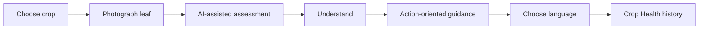
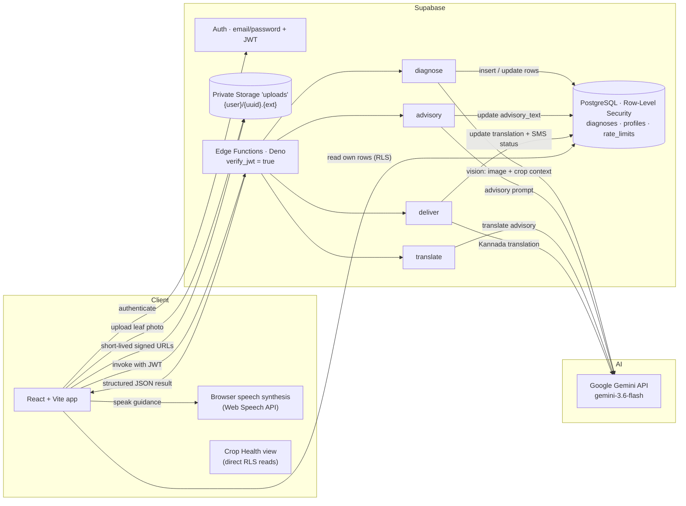
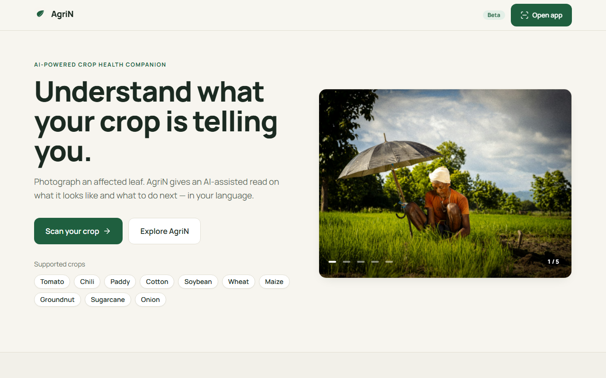
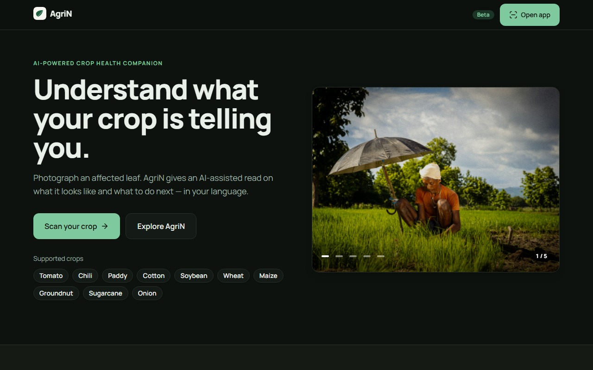
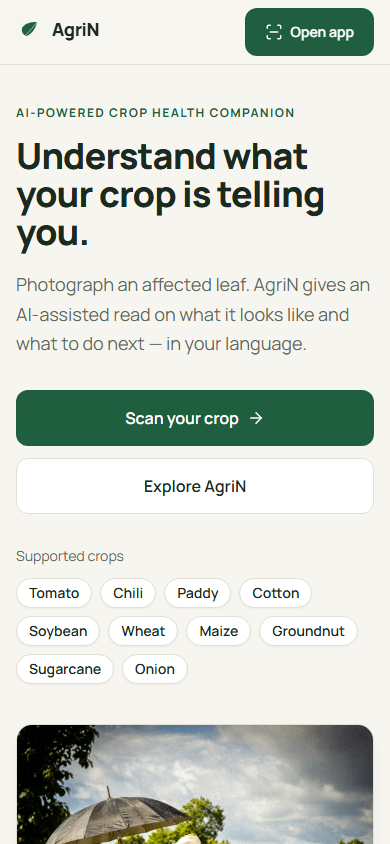

# AgriN — AI-Powered Crop Health Companion

AgriN turns a photo of an affected crop leaf into plain-language guidance a farmer can act on — in the language they actually read. Built for small-scale Indian farming, it runs entirely in the web browser with a server-side AI core: you choose a crop, photograph a leaf, and AgriN explains what it likely is and what to do next, then keeps every scan in a private history you can monitor over time.

One calm loop:

**Scan → Understand → Act → Monitor**

- **Scan** — choose a crop and photograph an affected leaf.
- **Understand** — a plain-language read on the likely condition, with a confidence label only when the AI model provides one.
- **Act** — step-by-step, action-oriented guidance you can follow with locally available resources.
- **Monitor** — every scan is saved to your private Crop Health history, grouped by crop.


---

## Why AgriN

When a crop starts failing, a small farm's options are slow and uncertain: guess from memory, wait for an expert who may be far away, or treat blindly. The hardest step is the first one — *what is wrong with this plant?*

AgriN shortens precisely that step. It turns a visible, photographable problem (leaf spots, curling, discolouration, wilting) into an honest, actionable read: what the photo shows, what to do next, and what to monitor. Every answer stays attached to that crop's private history, so patterns become visible over the season — and guidance is delivered in the language the farmer reads, not the language a model defaulted to.

---

## How AgriN Works

1. **Choose a crop** — from 10 supported Indian crops.
2. **Photograph an affected leaf** — validated, previewed, and stored privately.
3. **AI analyzes the image** — server-side, with the crop as context.
4. **Understand the likely condition** — disease name, what the photo shows, confidence when available.
5. **Receive practical guidance** — clear, actionable treatment steps.
6. **Choose a guidance language** — one of nine, with spoken audio when a device voice is installed.
7. **Monitor the crop** — every scan is saved to Crop Health and grouped by crop.



---

## Product Highlights

### AI-assisted crop assessment

Photo-based assessment runs through Google Gemini **on the server**. The browser only ever sends the image and receives the result — it never touches the AI key.

### Action-oriented guidance

Every result is structured the way a farmer needs it: **what the photo shows**, **what to do now**, and **what to monitor**. Guidance stays practical and locally actionable.

### Nine-language guidance

The advisory is translated on demand into **English, ಕನ್ನಡ, हिन्दी, मराठी, తెలుగు, தமிழ், മലയാളം, বাংলা, and ગુજરાતી** — and the whole app UI is available in all nine too.

### Device voice guidance

When a matching voice is installed on the device, guidance can be read aloud with the browser's speech synthesis — and when one isn't, AgriN says so rather than reading in the wrong language.

### Crop Health

Saved scans are grouped by crop so a farmer can track how each crop is doing over time. Only real scan rows are shown — nothing is fabricated.

### Private by design

Supabase Auth, a private Storage bucket, Row-Level Security, and owner-scoped image paths. Every scan belongs to exactly one account.

### Honest AI boundaries

No invented confidence levels, no fabricated weather, no fake SMS receipts, no guaranteed diagnosis. If the AI service is slow or busy, the app says so — and suggests a retry.

First-time visitors can scan immediately: AgriN auto-creates a private session account (no sign-up wall), while standard email sign-in provides continuity across devices.

---

## Architecture at a Glance



**Gemini requests are made server-side through Supabase Edge Functions. The browser never receives the Gemini API key.** The user's JWT is the only credential the browser holds, and every Edge Function is `verify_jwt = true`.

- **Images** are stored in a **private Storage bucket** at `{user.id}/{uuid}.{ext}` — the owner folder is enforced by Storage policies, and the file is re-verified (magic bytes, size) by the server after upload.
- **Database access is protected by Row-Level Security.** Browsers may only read their own rows; writes happen inside Edge Functions after ownership checks.
- **User requests carry authenticated context.** Public anon-key access is paired with a real Supabase JWT session, and `auth.uid()` (never a client-supplied value) is used for all ownership decisions — guarded against IDOR.
- **AI results return to the browser through the application backend** as validated, structured JSON, not raw model output.

---

## Google Technologies

**Google Gemini API — `gemini-3.6-flash`** is the AI engine at the heart of AgriN, invoked from Supabase Edge Functions:

- **`diagnose`** sends the uploaded crop image (with crop context and location) to Gemini Vision, which returns a strict JSON diagnosis: disease, visible symptoms, treatment advisory, and a confidence label (`High | Medium | Low`) only when the model provides one.
- **`advisory`** asks Gemini for a focused, plain-language treatment plan the farmer can start with locally available resources.
- **`translate`** asks Gemini to translate that advisory on demand into the reader's chosen language (English returns the stored advisory directly, with no AI call).
- **`deliver`** asks Gemini for a fluent Kannada translation used by the SMS-era preview, and records an honest status showing SMS is **simulated**.

Gemini API credentials remain **server-side** — injected through the Edge Function environment, never shipped to the browser.

Gemini is what turns a photo of a leaf into "here is what it likely is, and what to do." That image understanding — grounded in the crop the farmer names — is the entire value of the product, and it is the **only** Google technology used. No Firebase, no Vertex AI, no Google Cloud, no Maps.

---

## Security & Privacy

| Boundary | What AgriN does |
|---|---|
| **Authentication** | Supabase Auth with email/password; sessions persist as JWTs; sign-in, sign-up, password reset, and sign-out. |
| **JWT-protected functions** | All four Edge Functions run with `verify_jwt = true`; the user id always comes from the verified token, never from the request body. |
| **Row-Level Security** | `diagnoses`, `profiles`, and `rate_limits` are RLS-enforced — users can only reach their own rows. |
| **Private Storage** | Images live in a private `uploads` bucket; policies allow access only inside the owner's folder. |
| **Image validation** | **Twice.** The browser checks type and size (≤ 5 MB) before upload; the Edge Function re-downloads and re-verifies magic bytes and size server-side. |
| **Ownership checks / IDOR protection** | Every resource read (diagnosis, image, advisory) re-verifies ownership against `auth.uid()` before any action. |
| **Server-side AI credentials** | The Gemini key exists only in the gitignored Edge Function environment. |
| **Rate limiting** | Transactional per-user, per-endpoint limits (diagnose 5/hr; advisory, translate, deliver 10/hr) enforced in PostgreSQL. |
| **Input sanitisation** | Crop and location fields are sanitised before reaching prompts; translation targets are allowlisted. |
| **No committed credentials** | `.env`, `.env.local`, Edge Function `.env`, and logs are gitignored; the repo contains no real secrets. |

---

## AI Safety / Honesty

AgriN is **AI-assisted crop care, not a professional agricultural diagnostic system**. That boundary is treated as a design principle, not a disclaimer:

- Confidence labels are shown **only when the model provides one** — never synthesized.
- Weather is **never fabricated** — weather context is deliberately absent rather than guessed.
- SMS delivery is **honestly labelled as simulated** — no fake "sent" receipt.
- Spoken guidance never silently substitutes a wrong-language voice — if no matching device voice exists, the Play control is disabled with a clear note.
- AI failures (busy model, quota, timeout) are **surfaced honestly** with a retry path — never masked as a fake result.
- Before applying anything, AgriN **recommends confirming with a local agricultural extension officer**.

---

## Supported Crops

Crop selection is supported for any of these 10 crops:

| Crop | Tip for a useful scan |
|---|---|
| Tomato | Leaf spots, curling, or fruit damage |
| Chili | Spots or curling on leaves and fruit |
| Paddy | Leaf blades with spots or discolouration |
| Cotton | Leaf spots, wilting, or boll damage |
| Soybean | Leaf spots, yellowing, or wilt |
| Wheat | Streaks, rust pustules, or leaf discolouration |
| Maize | Ragged lesions or discoloured streaks on leaves |
| Groundnut | Circular leaf spots or yellowing |
| Sugarcane | Striped or reddened lesions on leaves |
| Onion | Blotches, yellowing leaf tips, or rot |

>Crop selection indicates the crop is supported by the current generic AI pipeline; it is **not** a claim that every disease affecting that crop is covered.

---

## Languages

AgriN supports **nine languages** end-to-end:

| Language | Native name | UI | AI advisory translation | Device voice |
|---|---|---|---|---|
| English | English | ✓ | ✓ (no AI call needed) | when a voice is installed |
| Kannada | ಕನ್ನಡ | ✓ | ✓ | when a voice is installed |
| Hindi | हिन्दी | ✓ | ✓ | when a voice is installed |
| Marathi | मराठी | ✓ | ✓ | when a voice is installed |
| Telugu | తెలుగు | ✓ | ✓ | when a voice is installed |
| Tamil | தமிழ் | ✓ | ✓ | when a voice is installed |
| Malayalam | മലയാളം | ✓ | ✓ | when a voice is installed |
| Bengali | বাংলা | ✓ | ✓ | when a voice is installed |
| Gujarati | ગુજરાતી | ✓ | ✓ | when a voice is installed |

There is an important distinction:

- **UI language** — the app interface itself is fully translated into each language.
- **AI advisory translation** — the AI-generated guidance is translated **on demand** per language and cached during the visit.
- **Device voice** — spoken guidance uses the browser's speech synthesis (Web Speech API) with the best matching installed voice. **Spoken audio is only offered when a matching voice exists on the device** — AgriN never reads guidance silently in a wrong language.

---

## Demo

- **Demo video:** coming before submission.
- **Live application:** deployed URL to be added before submission.

The demo walks the **golden path**, which was verified end-to-end during development: sign in (or auto-provision) → choose Tomato → upload a real tomato-leaf photo → Gemini diagnosis → advisory → guidance in the chosen language, with device audio → saved scan in Crop Health. Everything shown is real — auth, storage, PostgreSQL, Edge Functions, and the Google Gemini API.

> Because Gemini operates on a free-tier quota, the demo may occasionally hit a fair-use limit; the app then shows an honest message and the retry path, never a fabricated result.

---

## Screenshots

Real captures from the current AgriN UI.



The premium landing page in light mode, with hero imagery.



The dark theme applied to the landing page.


The scan form: crop selector, photo upload with live preview, and optional location/phone fields.



The responsive app on a mobile viewport.

---

## Tech Stack

| Layer | Technology |
|---|---|
| Frontend | React 19 + TypeScript + Vite 8 |
| Styling | Tailwind CSS 4 (dark mode via CSS variables) |
| Icons | lucide-react |
| Backend | Supabase (Auth, Storage, PostgreSQL, Edge Functions) |
| Database | PostgreSQL 17 |
| Auth | Supabase Auth (email/password, JWT, RLS) |
| Storage | Supabase Storage (private bucket) |
| Edge Functions | Supabase Edge Functions · Deno 2 |
| AI | Google Gemini API (`gemini-3.6-flash`), server-side only |
| TTS | Web Speech API (device voices) |
| Routing | react-router-dom |
| Testing | Vitest + React Testing Library, oxlint |

---

## Local Development

### Prerequisites

- **Node.js 18+** (built against Node 24)
- **Docker Desktop** (for the local Supabase stack)
- **Supabase CLI** (`npm i -g supabase`, or pinned via `npx supabase`)
- A **Google Gemini API key** for real AI calls (optional — everything else works without it)

### 1. Install dependencies

```bash
npm install
```

### 2. Start the local Supabase stack

```bash
npx supabase start
```

This boots Postgres, Auth, Storage, the Edge Functions runtime, and Studio, and applies the migrations in `supabase/migrations/`.

### 3. Add the Gemini API key (server-side)

Edge Functions read it from `supabase/functions/.env` (gitignored); `supabase start` loads it automatically:

```
GEMINI_API_KEY="your-real-gemini-api-key"
```

### 4. Configure the frontend

Copy `.env.example` to `.env.local` (gitignored) and fill in the values from your local stack:

```
VITE_SUPABASE_URL=http://127.0.0.1:54321
VITE_SUPABASE_ANON_KEY=<your anon key — from `npx supabase status -o env`>
```

The anon key is public by design. **Never put service-role or Gemini credentials in frontend environment variables.**

### 5. Run the app

```bash
npm run dev
```

Open `http://localhost:5173`.

### Other useful commands

```bash
npx supabase status            # URLs + keys for the running local stack
npm run test                   # unit + component tests (Vitest)
npm run lint                   # oxlint
npm run build                  # type-check (tsc -b) + production build
```

---

## Environment Variables

| Variable | Belongs in | Purpose |
|---|---|---|
| `VITE_SUPABASE_URL` | `.env.local` (browser) | Supabase instance URL, e.g. `http://127.0.0.1:54321` locally |
| `VITE_SUPABASE_ANON_KEY` | `.env.local` (browser) | Public anon key for the Supabase client |
| `GEMINI_API_KEY` | `supabase/functions/.env` (server only) | Gemini key used by Edge Functions; **never** a Vite/browser variable |

Real values are never committed — `.env.local` and `supabase/functions/.env` are gitignored.

---

## Testing & Verification

Verified against the current repository:

- **`npm run test`** — **101 tests passing across 12 files** (Vitest + React Testing Library): auth, scan flow, crop selection, language configuration and translation, result rendering, and TTS behaviour.
- **`npm run lint`** — no errors (oxlint; existing informational warnings only).
- **`npm run build`** — type-check (`tsc -b`) and production build succeed.
- **Browser verification** — automated sweeps across **4 viewports (desktop 1440/1280, tablet 768, mobile 390)** in **light and dark themes**: sign in / sign up / sign out / password reset, the full scan flow with honest progress stages, language selection + persistence, light/dark theme persistence, and no horizontal overflow on any page. Hindi-language UI was spot-checked.
- **End-to-end (real AI)** — the golden path (Tomato → real leaf photo → Gemini diagnosis → advisory → language guidance → Crop Health) was verified live during development. Gemini's free-tier quota limits how often real scans can run; when spent, the app says so honestly.

---

## Project Structure

```
src/
  lib/                 # supabase client, crops, languages, strings, translation
  hooks/               # useAuth, useLanguage, useTTS, useCropHealth, useTheme
  components/
    ui/                # shared primitives (Button, Card, Field, Badge…)
    layout/            # AppLayout, Brand
    auth/              # SignedOutGate
    scan/              # CropSelector, UploadZone, ScanResult
    settings/          # LanguageSelector
  pages/               # Landing, Scan, Health, Settings, Auth
supabase/
  config.toml          # local stack configuration
  migrations/          # SQL schema, RLS, rate-limit RPC
  functions/           # edge functions: diagnose / advisory / deliver / translate
    _shared/agrin.ts   # auth, rate-limit, Gemini, and response helpers
    .env               # server-side Gemini key (gitignored)
docs/
  migration-design.md  # Firebase → Supabase migration history
  screenshots/         # app screenshots
```

---

## Limitations

- **Not a substitute for professional diagnosis.** Results are advisory; always confirm treatment with a local agricultural extension officer.
- **AI output can be imperfect.** Gemini reads the photo and can be wrong or uncertain; confidence is shown only when the model provides it.
- **Voice depends on the device.** All nine languages are supported for guidance; spoken audio requires a matching installed voice, otherwise the Play control is disabled with an honest note.
- **No weather or climate advisories** — deliberately left unimplemented rather than fabricated.
- **Crop support is selectable, generic-pipeline processing** — not an exhaustive per-crop disease database.
- **Gemini free-tier quota** affects how often real scans can run; the app surfaces this honestly with a retry path.
- **SMS delivery is simulated** (no provider connected) and clearly labelled as such.

---

## License

MIT — see [`LICENSE`](LICENSE).

## Disclaimer

AgriN provides AI-assisted crop guidance for general care. Results are advisory and not a professional or definitive agricultural diagnosis. Local conditions, soil, and weather differ — always confirm any treatment with a local agricultural extension officer before applying it.